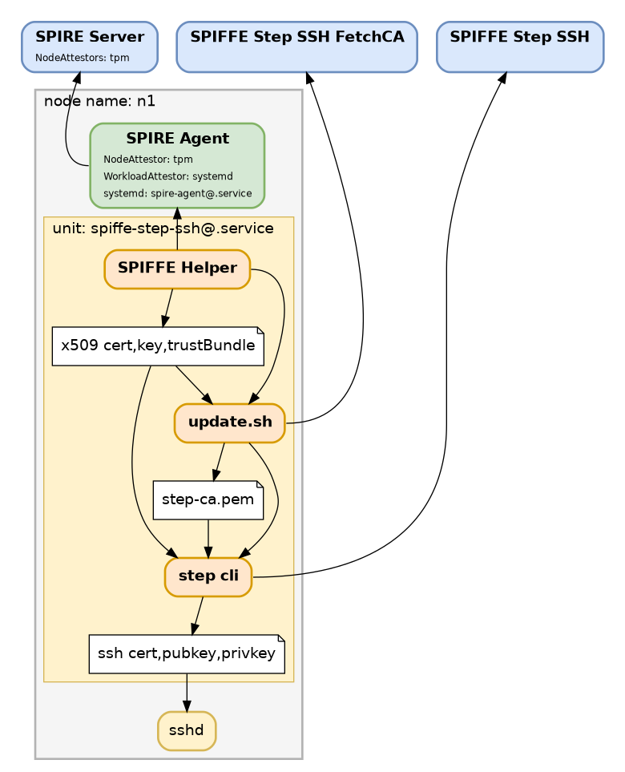

# spiffe-step-ssh

[](https://opensource.org/licenses/Apache-2.0)
[](https://github.com/spiffe/spiffe/blob/main/MATURITY.md#development)

Issue SSH host certificates using SPIFFE

## Client Dependencies

A working spire-agent bound to a spire-server. See [helm-chart install instructions](https://spiffe.io/docs/latest/spire-helm-charts-hardened-about/installation/#quick-start) or [general quickstart](https://spiffe.io/docs/latest/try/)

Also, the step binary needs to be installed. [Install Instructions](https://smallstep.com/docs/step-cli/installation/)

## Server

There is a helm chart available [here](https://github.com/spiffe/helm-charts-hardened/tree/main/charts/spiffe-step-ssh)

## Install

```
make install
```

## Diagram


## High Availability

There are configurations that can get you to various levels of High Availability, upto and including running two complete spiffe trust domains, two spiffe-step-ssh servers, and two spiffe-step-ssh clients.

Add into /etc/spiffe/step-ssh/a.conf
```
SPIFFE_STEP_SSH_URL=https://spiffe-step-ssh-a.example.org
SPIFFE_STEP_SSH_FETCHCA_URL=https://spiffe-step-ssh-fetchca-a.example.org
```

Add into /etc/spiffe/step-ssh/b.conf
```
SPIFFE_STEP_SSH_URL=https://spiffe-step-ssh-b.example.org
SPIFFE_STEP_SSH_FETCHCA_URL=https://spiffe-step-ssh-fetchca-b.example.org
```

Enable and Start the clients
```
systemctl enable spiffe-step-ssh@a spiffe-step-ssh@b
systemctl start spiffe-step-ssh@a spiffe-step-ssh@b
```

Add both Step CA ssh signatures into `known_hosts` on your ssh clients.
